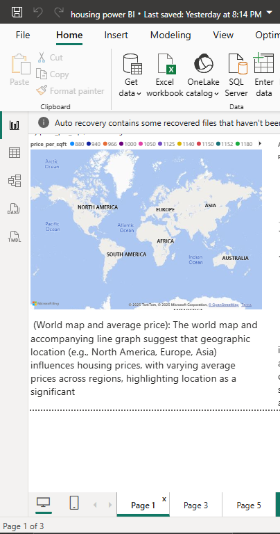

#  Graphical Analysis of Housing Price Influencers

** Presented by**: Kayonga Calvin  
** Date**: August 4, 2025  
** Contact**: 0780953107  
** Power BI Project**: `Bigdata_Final_Project.pbix`  
** Dataset Source**: [OpenDataBay Housing Dataset](https://www.opendatabay.com/data/financial/2bb02841-0f03-44e7-aa13-05d31d499d1c)

---

##  Project Overview

This project aims to identify and analyze the key factors influencing housing prices using data visualization tools. Leveraging Power BI, we explored how size, location, price category, and proximity to water impact housing values.

---

##  Data Cleaning

- Removed duplicates and handled missing values  
- Normalized numerical and categorical fields  
- Ensured consistency in property size and price formats
- 

---

##  Graphical Insights

###  Total Price by Size Category
- **Observation**: Properties between `2000-3000 sqft` and `~1000 sqft` dominate total price volume.
- **Insight**: Both large and compact homes are major contributors to the market — size matters significantly.
 
###  Total Price by Sale Year
- **Observation**: Year `2015` had the highest total price sales.
- **Insight**: A potential housing market spike; likely due to regional or economic factors.
 
###  Average Price by Price Category
- **Observation**: Homes priced above `$1.2M` lead in average pricing.
- **Insight**: High-tier segmentation is evident — ideal for targeted investment strategies.
 
###  Average Price by Region
- **Observation**: `North America` and `Europe` show the highest average prices.
- **Insight**: Region heavily influences value — geographic location is crucial.
 
###  Waterfront Analysis
- **Observation**: Waterfront homes have both higher total price sums and price per sqft.
- **Insight**: Water proximity increases property value — recommended for high-return development.
 
---

##  Summary of Graphical Trends

| Factor         | Insight                                                   |
|----------------|------------------------------------------------------------|
| Size           | Dominated by 2K–3K sqft & 1K sqft ranges                   |
| Year           | Peak total sales volume in 2015                            |
| Price Category | High-end homes dominate average price brackets             |
| Location       | North America & Europe lead in housing value               |
| Waterfront     | Adds premium to both total and per-square-foot pricing     |

---

##  Conclusion

This visual analysis offers key takeaways for real estate stakeholders. Understanding how different features affect housing prices can inform smarter investment, pricing, and development decisions.

---
